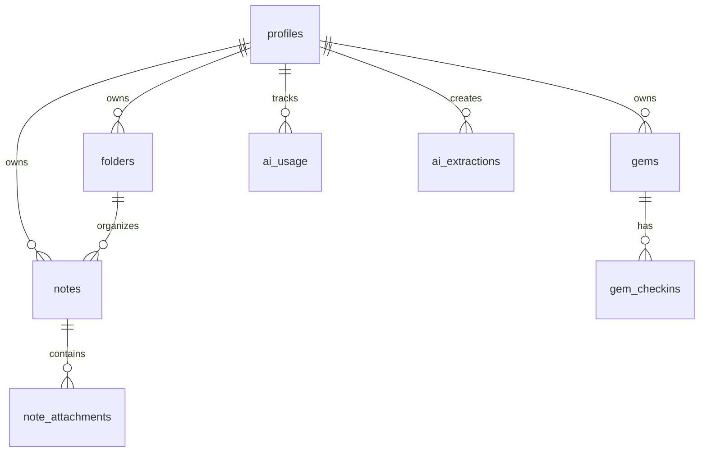
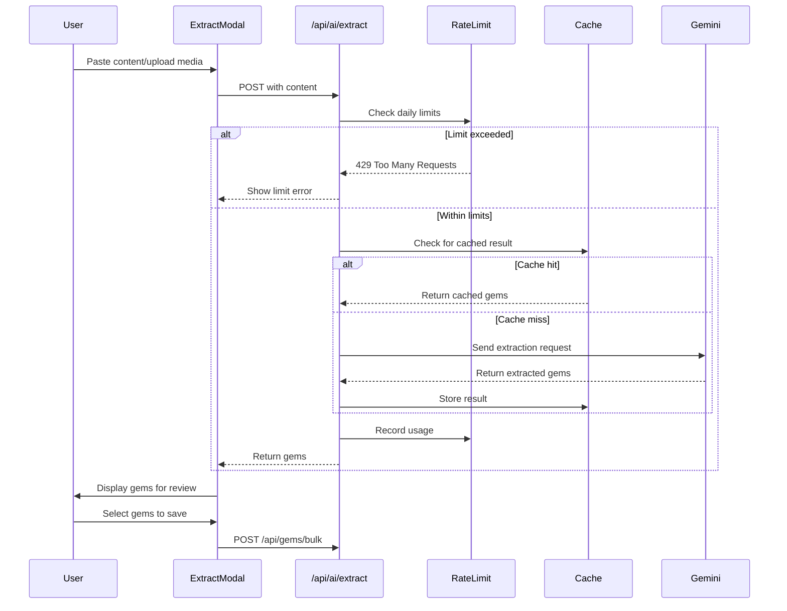

# GemKeeper Architecture

## 1. Overview

**GemKeeper** is a wisdom accountability partner application that helps users capture, remember, and apply insights from books, podcasts, videos, and life experiences. The app enforces intentionality by limiting users to 10 active "gems" at a time.

### Key Features
- **Gem Collection**: Capture insights manually or via AI extraction
- **Daily Prompts**: Morning reminder of a gem to apply
- **Evening Check-ins**: Track whether gems were applied
- **Graduation System**: Gems with 5+ applications move to Trophy Case
- **AI Extraction**: Use Google Gemini to extract insights from content

### Tech Stack Summary

| Layer | Technology |
|-------|------------|
| Framework | Next.js 16.1.4 (App Router) |
| Language | TypeScript 5 |
| Styling | Tailwind CSS 4 |
| UI Components | shadcn/ui + Radix UI |
| Database | Supabase (PostgreSQL) |
| Authentication | Supabase Auth |
| AI/ML | Google Gemini API 2.0 Flash |
| Hosting | Vercel |
| Icons | Lucide React |

---

## 2. Project Structure

```
gemkeeper/
├── app/                          # Next.js App Router pages
│   ├── api/                      # API routes
│   │   ├── ai/extract/           # AI extraction endpoint
│   │   └── gems/bulk/            # Bulk gem creation endpoint
│   ├── auth/                     # Auth actions (signup, signin, signout)
│   ├── checkin/                  # Evening check-in page
│   ├── daily/                    # Daily prompt page (morning gem)
│   ├── dashboard/                # Main dashboard
│   ├── gems/                     # Gem management
│   │   └── [id]/                 # Gem detail page
│   ├── login/                    # Authentication page
│   ├── onboarding/               # First-time user setup
│   ├── settings/                 # User preferences
│   ├── trophy-case/              # Graduated gems showcase
│   ├── folders/                  # Folder organization
│   ├── notes/                    # Note operations
│   ├── layout.tsx                # Root layout
│   └── page.tsx                  # Home page
├── components/                   # React components
│   ├── ui/                       # shadcn/ui components
│   ├── gem-detail.tsx            # Gem display with actions
│   ├── gem-form.tsx              # Manual gem creation
│   ├── gem-edit-form.tsx         # Edit gem content
│   ├── extract-gems-modal.tsx    # AI extraction UI
│   ├── extracted-gem-card.tsx    # Review extracted gems
│   ├── graduate-gem-dialog.tsx   # Graduation confirmation
│   ├── retire-gem-dialog.tsx     # Retirement options
│   ├── app-sidebar.tsx           # Navigation sidebar
│   ├── layout-shell.tsx          # Main layout wrapper
│   ├── ai-consent-modal.tsx      # Privacy consent
│   ├── onboarding.tsx            # Onboarding carousel
│   └── ...                       # Other components
├── lib/                          # Utilities and services
│   ├── ai/                       # AI/Gemini integration
│   │   ├── gemini.ts             # Gemini API logic
│   │   └── rate-limit.ts         # Rate limiting & caching
│   ├── supabase/                 # Database clients
│   │   ├── client.ts             # Browser client
│   │   └── server.ts             # Server client
│   ├── types/                    # Type definitions
│   │   └── gem.ts                # Gem-related types
│   ├── types.ts                  # General types
│   ├── gems.ts                   # Gem service functions
│   └── utils.ts                  # Utility helpers
├── public/                       # Static assets
├── middleware.ts                 # Auth middleware
├── env.example                   # Environment template
├── next.config.ts                # Next.js configuration
├── tailwind.config.js            # Tailwind configuration
├── tsconfig.json                 # TypeScript configuration
└── supabase-schema.sql           # Database schema
```

### Directory Purposes

| Directory | Purpose |
|-----------|---------|
| `app/` | Next.js App Router pages and API routes |
| `app/api/` | Server-side API endpoints |
| `components/` | Reusable React components |
| `components/ui/` | shadcn/ui base components |
| `lib/` | Business logic, services, utilities |
| `lib/ai/` | Google Gemini integration |
| `lib/supabase/` | Database client configuration |
| `public/` | Static files served at root |

---

## 3. Tech Stack Details

### Next.js 16.1.4

**What it is**: React framework for production applications with server-side rendering, static generation, and API routes.

**Why it's used**:
- App Router provides file-based routing with React Server Components
- Built-in API routes for backend functionality
- Excellent TypeScript support
- Optimized for Vercel deployment

**Configuration** (`next.config.ts`):
```typescript
import type { NextConfig } from "next";

const nextConfig: NextConfig = {
  /* Currently minimal config, ready for extensions */
};

export default nextConfig;
```

### TypeScript 5

**What it is**: Typed superset of JavaScript for safer, more maintainable code.

**Why it's used**:
- Compile-time type checking prevents runtime errors
- Better IDE support with autocompletion
- Self-documenting code through interfaces
- Strict mode enabled for maximum safety

**Configuration** (`tsconfig.json`):
```json
{
  "compilerOptions": {
    "target": "ES2017",
    "strict": true,
    "paths": {
      "@/*": ["./*"]
    }
  }
}
```

### Tailwind CSS 4

**What it is**: Utility-first CSS framework for rapid UI development.

**Why it's used**:
- Rapid prototyping with utility classes
- Consistent design system
- No CSS file management
- Built-in responsive design
- Dark mode support

**Configuration** (`tailwind.config.js`):
- Custom color palette
- Extended spacing and typography
- Dark mode via class strategy

### shadcn/ui

**What it is**: Collection of re-usable components built on Radix UI primitives.

**Why it's used**:
- Accessible components out of the box
- Full control over styling (components are copied, not installed)
- Consistent design language
- Works seamlessly with Tailwind

**Components used**:
- `button`, `card`, `dialog`, `dropdown-menu`
- `input`, `label`, `select`, `textarea`
- `badge`, `toast`

### Supabase

**What it is**: Open-source Firebase alternative with PostgreSQL, auth, and storage.

**Why it's used**:
- **Database**: PostgreSQL with Row Level Security (RLS)
- **Auth**: Email/password authentication with session management
- **Storage**: File uploads for note attachments
- **Real-time**: WebSocket subscriptions (available if needed)

**Configuration** (`lib/supabase/`):

Browser client (`client.ts`):
```typescript
import { createBrowserClient } from "@supabase/ssr";

export function createClient() {
  return createBrowserClient(
    process.env.NEXT_PUBLIC_SUPABASE_URL!,
    process.env.NEXT_PUBLIC_SUPABASE_ANON_KEY!
  );
}
```

Server client (`server.ts`):
```typescript
import { createServerClient } from "@supabase/ssr";
import { cookies } from "next/headers";

export async function createClient() {
  const cookieStore = await cookies();
  return createServerClient(
    process.env.NEXT_PUBLIC_SUPABASE_URL!,
    process.env.NEXT_PUBLIC_SUPABASE_ANON_KEY!,
    {
      cookies: {
        getAll: () => cookieStore.getAll(),
        setAll: (cookiesToSet) => { /* ... */ }
      }
    }
  );
}
```

### Google Gemini API

**What it is**: Google's multimodal AI model for text and media understanding.

**Why it's used**:
- Extract actionable insights from long-form content
- Process images, audio, and video
- Cost-effective with generous free tier
- Fast inference with Flash model

**Model**: `gemini-2.0-flash-001`

**Configuration**: API key stored in `GOOGLE_AI_API_KEY` environment variable.

### Vercel

**What it is**: Platform for deploying and hosting Next.js applications.

**Why it's used**:
- Zero-config deployment for Next.js
- Automatic HTTPS and CDN
- Preview deployments for PRs
- Edge functions support
- Built-in analytics

---

## 4. Database Schema

### Entity Relationship Diagram



### Tables

#### `profiles`
User preferences and settings.

| Column | Type | Constraints | Description |
|--------|------|-------------|-------------|
| `id` | UUID | PK, FK → auth.users | User ID |
| `email` | TEXT | NOT NULL | User email |
| `name` | TEXT | | Display name |
| `timezone` | TEXT | | e.g., "America/New_York" |
| `daily_prompt_time` | TIME | | Morning prompt time |
| `checkin_time` | TIME | | Evening check-in time |
| `calendar_connected` | BOOLEAN | DEFAULT false | Calendar integration |
| `onboarding_completed` | BOOLEAN | DEFAULT false | Completed onboarding |
| `ai_consent_given` | BOOLEAN | DEFAULT false | AI feature consent |
| `ai_consent_date` | TIMESTAMPTZ | | When consent was given |
| `created_at` | TIMESTAMPTZ | DEFAULT now() | |
| `updated_at` | TIMESTAMPTZ | DEFAULT now() | |

**RLS**: Users can only view/edit their own profile.

---

#### `gems`
Core feature table for wisdom gems.

| Column | Type | Constraints | Description |
|--------|------|-------------|-------------|
| `id` | UUID | PK | Gem ID |
| `user_id` | UUID | FK → auth.users, NOT NULL | Owner |
| `content` | TEXT | NOT NULL, max 200 chars | Gem text |
| `source` | TEXT | | Book/podcast/article name |
| `source_url` | TEXT | | URL to source |
| `context_tag` | ENUM | | Category tag |
| `custom_context` | TEXT | | Custom tag (when other) |
| `status` | ENUM | DEFAULT 'active' | active/retired/graduated |
| `application_count` | INTEGER | DEFAULT 0 | Times applied |
| `skip_count` | INTEGER | DEFAULT 0 | Times skipped |
| `last_surfaced_at` | TIMESTAMPTZ | | Last shown to user |
| `last_applied_at` | TIMESTAMPTZ | | Last applied |
| `retired_at` | TIMESTAMPTZ | | When archived/released |
| `graduated_at` | TIMESTAMPTZ | | When graduated |
| `created_at` | TIMESTAMPTZ | DEFAULT now() | |
| `updated_at` | TIMESTAMPTZ | DEFAULT now() | |

**Context Tags**: `meetings`, `feedback`, `conflict`, `focus`, `health`, `relationships`, `parenting`, `other`

**Status Values**: `active`, `retired`, `graduated`

**Indexes**: `user_id`, `status`, `created_at`

**RLS**: Users can only CRUD their own gems.

---

#### `gem_checkins`
Check-in history for tracking gem applications.

| Column | Type | Constraints | Description |
|--------|------|-------------|-------------|
| `id` | UUID | PK | Check-in ID |
| `gem_id` | UUID | FK → gems | Associated gem |
| `user_id` | UUID | FK → auth.users | User |
| `checkin_type` | ENUM | | morning_prompt/evening_checkin |
| `response` | ENUM | | yes/no/maybe |
| `note` | TEXT | | Reflection notes |
| `created_at` | TIMESTAMPTZ | DEFAULT now() | |

**Indexes**: `gem_id`, `user_id`, `created_at`

---

#### `notes`
User notes and staging area for content.

| Column | Type | Constraints | Description |
|--------|------|-------------|-------------|
| `id` | UUID | PK | Note ID |
| `user_id` | UUID | FK → auth.users | Owner |
| `title` | TEXT | | Note title |
| `content` | TEXT | | Note content |
| `folder_id` | UUID | FK → folders, ON DELETE SET NULL | Organization |
| `tags` | TEXT[] | | Tags array |
| `is_favorite` | BOOLEAN | DEFAULT false | Favorited |
| `created_at` | TIMESTAMPTZ | DEFAULT now() | |
| `updated_at` | TIMESTAMPTZ | DEFAULT now() | |

**Indexes**: `user_id`, `updated_at`, `is_favorite`

**RLS**: Users can only access their own notes.

---

#### `note_attachments`
Media files attached to notes.

| Column | Type | Constraints | Description |
|--------|------|-------------|-------------|
| `id` | UUID | PK | Attachment ID |
| `note_id` | UUID | FK → notes | Parent note |
| `file_name` | TEXT | | Original filename |
| `file_type` | TEXT | | MIME type |
| `file_size` | INTEGER | | Size in bytes |
| `storage_path` | TEXT | | Supabase Storage path |
| `created_at` | TIMESTAMPTZ | DEFAULT now() | |

**RLS**: Users can only access attachments on their notes.

---

#### `folders`
Note organization structure.

| Column | Type | Constraints | Description |
|--------|------|-------------|-------------|
| `id` | UUID | PK | Folder ID |
| `user_id` | UUID | FK → auth.users | Owner |
| `name` | TEXT | | Folder name |
| `created_at` | TIMESTAMPTZ | DEFAULT now() | |
| `updated_at` | TIMESTAMPTZ | DEFAULT now() | |

**RLS**: Users can only manage their own folders.

---

#### `ai_usage`
Daily rate limiting for AI features.

| Column | Type | Constraints | Description |
|--------|------|-------------|-------------|
| `id` | UUID | PK | Usage ID |
| `user_id` | UUID | FK → auth.users | User |
| `usage_date` | DATE | | Date of usage |
| `extraction_count` | INTEGER | DEFAULT 0 | Extractions today (max 10) |
| `tokens_used` | INTEGER | DEFAULT 0 | Tokens today (max 50,000) |
| `created_at` | TIMESTAMPTZ | DEFAULT now() | |
| `updated_at` | TIMESTAMPTZ | DEFAULT now() | |

**Unique Constraint**: `(user_id, usage_date)`

---

#### `ai_extractions`
Cached extraction results.

| Column | Type | Constraints | Description |
|--------|------|-------------|-------------|
| `id` | UUID | PK | Extraction ID |
| `user_id` | UUID | FK → auth.users | User |
| `input_content` | TEXT | | First 10,000 chars |
| `input_hash` | VARCHAR(64) | | SHA-256 hash for dedup |
| `source` | TEXT | | User attribution |
| `extracted_gems` | JSONB | | Array of extracted gems |
| `tokens_used` | INTEGER | | Tokens consumed |
| `created_at` | TIMESTAMPTZ | DEFAULT now() | |

**Indexes**: `user_id`, `input_hash`

---

## 5. API Routes

### POST `/api/ai/extract`

Extract gems from content using Gemini AI.

**Request Body**:
```typescript
{
  content?: string;           // Text (100-10,000 chars)
  source?: string;            // Attribution
  media?: Array<{
    mimeType: string;         // e.g., "image/png"
    data: string;             // Base64 encoded
  }>;
}
```

**Response**:
```typescript
{
  gems: ExtractedGem[];
  cached: boolean;
  usage: {
    extractionsToday: number;
    extractionsRemaining: number;
    tokensToday: number;
    canExtract: boolean;
    resetTime: Date;
  };
}
```

**Status Codes**:
- `200`: Success
- `401`: Unauthorized
- `403`: AI consent required
- `422`: No actionable insights found
- `429`: Daily limit exceeded
- `500`: AI API error

---

### POST `/api/gems/bulk`

Create multiple gems at once (from AI extraction).

**Request Body**:
```typescript
{
  gems: Array<{
    content: string;
    context_tag: ContextTag;
    source?: string;
    source_url?: string;
  }>;
}
```

**Response**:
```typescript
{
  gems: Gem[];
  count: number;
}
```

**Status Codes**:
- `200`: Success
- `400`: Would exceed 10 gem limit
- `401`: Unauthorized

---

## 6. Key Components

### Layout Components

| Component | File | Purpose |
|-----------|------|---------|
| Root Layout | `app/layout.tsx` | HTML structure, providers |
| Layout Shell | `components/layout-shell.tsx` | Header, sidebar, content area |
| App Sidebar | `components/app-sidebar.tsx` | Navigation menu |

### Page Components

| Page | File | Purpose |
|------|------|---------|
| Home | `app/page.tsx` | Landing/redirect based on auth |
| Login | `app/login/page.tsx` | Authentication |
| Gems | `app/gems/page.tsx` | Active gems list |
| Gem Detail | `app/gems/[id]/page.tsx` | Single gem view |
| Daily | `app/daily/page.tsx` | Morning prompt |
| Check-in | `app/checkin/page.tsx` | Evening check-in |
| Trophy Case | `app/trophy-case/page.tsx` | Graduated gems |
| Settings | `app/settings/page.tsx` | User preferences |
| Onboarding | `app/onboarding/page.tsx` | First-time setup |

### Gem Components

| Component | File | Purpose |
|-----------|------|---------|
| Gem Detail | `components/gem-detail.tsx` | Display gem with actions |
| Gem Form | `components/gem-form.tsx` | Manual creation |
| Gem Edit Form | `components/gem-edit-form.tsx` | Modify existing gem |
| Extracted Gem Card | `components/extracted-gem-card.tsx` | Review AI extractions |
| Graduate Dialog | `components/graduate-gem-dialog.tsx` | Graduation confirmation |
| Retire Dialog | `components/retire-gem-dialog.tsx` | Archive/release options |

### Modal Components

| Component | File | Purpose |
|-----------|------|---------|
| Extract Gems Modal | `components/extract-gems-modal.tsx` | AI extraction wizard |
| AI Consent Modal | `components/ai-consent-modal.tsx` | Privacy consent |

### UI Components (shadcn/ui)

Located in `components/ui/`:
- `badge.tsx` - Status indicators
- `button.tsx` - Action buttons
- `card.tsx` - Content containers
- `dialog.tsx` - Modal dialogs
- `dropdown-menu.tsx` - Context menus
- `input.tsx` - Text inputs
- `label.tsx` - Form labels
- `select.tsx` - Dropdown selects
- `textarea.tsx` - Multi-line inputs

---

## 7. Services & Libraries

### Supabase Clients (`lib/supabase/`)

**`client.ts`** - Browser client for client components:
```typescript
import { createBrowserClient } from "@supabase/ssr";

export function createClient() {
  return createBrowserClient(
    process.env.NEXT_PUBLIC_SUPABASE_URL!,
    process.env.NEXT_PUBLIC_SUPABASE_ANON_KEY!
  );
}
```

**`server.ts`** - Server client for server components and actions:
```typescript
export async function createClient() {
  const cookieStore = await cookies();
  return createServerClient(/* ... */);
}
```

### Gem Service (`lib/gems.ts`)

**CRUD Operations**:
- `createMultipleGems(gems[])` - Bulk insert
- `updateGem(id, input)` - Modify gem
- `deleteGem(gemId)` - Permanent deletion
- `retireGem(id, mode)` - Archive or release
- `graduateGem(id)` - Move to trophy case

**Queries**:
- `getActiveGems()` - All active gems
- `getActiveGemCount()` - Count of active gems
- `getDailyGem()` - Least recently surfaced gem
- `getGraduatedGems()` - Trophy case gems

**Check-in**:
- `logCheckin(gemId, type, response, note?)` - Record check-in

### AI Integration (`lib/ai/gemini.ts`)

**Functions**:
```typescript
// Extract from text content
extractGemsFromContent(content: string, source?: string): Promise<ExtractionResult>

// Extract from multimedia
extractGemsFromMultimedia(
  textContent: string | null,
  mediaData: MediaInput[],
  source?: string
): Promise<ExtractionResult>
```

**ExtractionResult**:
```typescript
interface ExtractionResult {
  gems: ExtractedGem[];
  tokensUsed: number;
}

interface ExtractedGem {
  content: string;          // Max 200 chars
  context_tag: ContextTag;
  source_quote?: string;    // Original quote
}
```

### Rate Limiting (`lib/ai/rate-limit.ts`)

**Limits**:
- 10 extractions per day
- 50,000 tokens per day
- Resets at midnight UTC

**Functions**:
```typescript
checkUsageLimit(userId: string): Promise<UsageStatus>
recordUsage(userId: string, tokensUsed: number): Promise<void>
getCachedExtraction(userId: string, hash: string): Promise<CachedResult | null>
cacheExtraction(userId: string, hash: string, ...): Promise<void>
hashContent(content: string): string  // SHA-256
```

---

## 8. Authentication Flow

### Middleware (`middleware.ts`)

```typescript
export async function middleware(request: NextRequest) {
  const { pathname } = request.nextUrl;

  // Refresh session
  const supabase = createClient(/* ... */);
  const { data: { user } } = await supabase.auth.getUser();

  // Protected routes
  const protectedRoutes = ['/dashboard', '/gems', '/daily', '/checkin', ...];

  if (protectedRoutes.includes(pathname)) {
    if (!user) {
      return NextResponse.redirect('/login');
    }

    // Check onboarding
    if (!profile.onboarding_completed && pathname !== '/onboarding') {
      return NextResponse.redirect('/onboarding');
    }
  }

  // Redirect logged-in users from login
  if (pathname === '/login' && user) {
    return NextResponse.redirect('/gems');
  }
}
```

### Auth Actions (`app/auth/actions.ts`)

```typescript
"use server"

export async function signUp(formData: FormData) {
  const supabase = await createClient();
  const { error } = await supabase.auth.signUp({
    email,
    password,
  });
  // Creates profile automatically via trigger
}

export async function signIn(formData: FormData) {
  const supabase = await createClient();
  const { error } = await supabase.auth.signInWithPassword({
    email,
    password,
  });
}

export async function signOut() {
  const supabase = await createClient();
  await supabase.auth.signOut();
}
```

### Session Management

- Sessions stored in HTTP-only cookies
- Automatic refresh on each request via middleware
- Supabase handles JWT tokens and expiration

---

## 9. AI Integration

### Gemini API Setup

**Model**: `gemini-2.0-flash-001`

**Initialization**:
```typescript
import { GoogleGenerativeAI } from "@google/generative-ai";

const genAI = new GoogleGenerativeAI(process.env.GOOGLE_AI_API_KEY!);
const model = genAI.getGenerativeModel({ model: "gemini-2.0-flash-001" });
```

### Extraction Flow



### Rate Limiting Strategy

| Limit | Value | Purpose |
|-------|-------|---------|
| Extractions/day | 10 | Prevent abuse |
| Tokens/day | 50,000 | Control costs |
| Reset time | Midnight UTC | Daily refresh |

### Caching Strategy

- **Key**: SHA-256 hash of input content
- **Scope**: Text-only extractions (not multimedia)
- **Storage**: `ai_extractions` table
- **Benefit**: Avoids re-processing identical content

---

## 10. Deployment

### Vercel Configuration

GemKeeper is deployed on Vercel with automatic deployments from the main branch.

**Build Settings**:
- Framework: Next.js
- Build Command: `next build`
- Output Directory: `.next`
- Install Command: `npm install`

### Environment Variables

Required in Vercel dashboard:

```bash
# Supabase
NEXT_PUBLIC_SUPABASE_URL=https://[project-id].supabase.co
NEXT_PUBLIC_SUPABASE_ANON_KEY=[anon-key]

# Google Gemini
GOOGLE_AI_API_KEY=[api-key]
```

### Build Process

1. Push to main branch triggers deployment
2. Vercel runs `npm install`
3. Vercel runs `next build`
4. Static pages are pre-rendered
5. API routes deployed as serverless functions
6. CDN caches static assets

### Preview Deployments

- Every PR gets a preview URL
- Isolated from production
- Uses same environment variables

---

## 11. External Services

### Supabase

**Project URL**: `https://[project-id].supabase.co`

**Features Used**:
- PostgreSQL database
- Row Level Security (RLS)
- Authentication (email/password)
- Storage (for attachments)

**Dashboard**: Manage schema, users, and policies at `supabase.com/dashboard`

### Google AI Studio

**Console**: `aistudio.google.com`

**API Key**: Generate at AI Studio for Gemini API access

**Model Used**: `gemini-2.0-flash-001` (fast, multimodal)

**Pricing**: Free tier available, then pay-per-token

### Vercel

**Dashboard**: `vercel.com/dashboard`

**Features**:
- Automatic deployments
- Preview URLs
- Analytics
- Logs

---

## Appendix: Type Definitions

### Gem Types (`lib/types/gem.ts`)

```typescript
type ContextTag =
  | "meetings"
  | "feedback"
  | "conflict"
  | "focus"
  | "health"
  | "relationships"
  | "parenting"
  | "other";

type GemStatus = "active" | "retired" | "graduated";

interface Gem {
  id: string;
  user_id: string;
  content: string;
  source: string | null;
  source_url: string | null;
  context_tag: ContextTag;
  custom_context: string | null;
  status: GemStatus;
  application_count: number;
  skip_count: number;
  last_surfaced_at: string | null;
  last_applied_at: string | null;
  retired_at: string | null;
  graduated_at: string | null;
  created_at: string;
  updated_at: string;
}

interface CreateGemInput {
  content: string;
  source?: string;
  source_url?: string;
  context_tag: ContextTag;
  custom_context?: string;
}

const MAX_ACTIVE_GEMS = 10;
```

### Profile & Note Types (`lib/types.ts`)

```typescript
interface Profile {
  id: string;
  email: string;
  name: string | null;
  daily_prompt_time: string | null;
  checkin_time: string | null;
  timezone: string | null;
  calendar_connected: boolean;
  onboarding_completed: boolean;
  ai_consent_given: boolean;
  ai_consent_date: string | null;
  created_at: string;
  updated_at: string;
}

interface Note {
  id: string;
  title: string | null;
  content: string | null;
  folder_id: string | null;
  attachments?: NoteAttachment[];
  created_at: string;
  updated_at: string;
  user_id: string;
  tags?: string[];
  is_favorite?: boolean;
}

interface NoteAttachment {
  id: string;
  note_id: string;
  file_name: string;
  file_type: string;
  file_size: number;
  storage_path: string;
  created_at: string;
}
```
