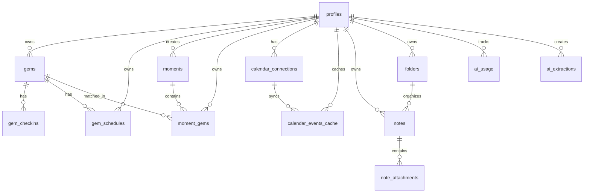
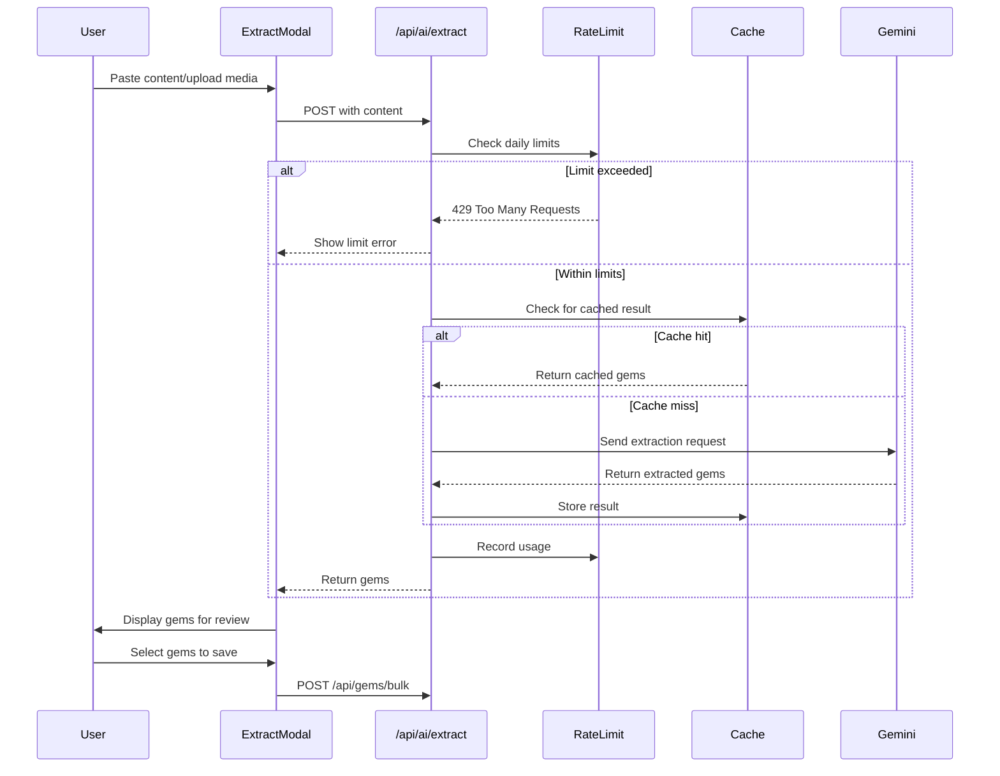
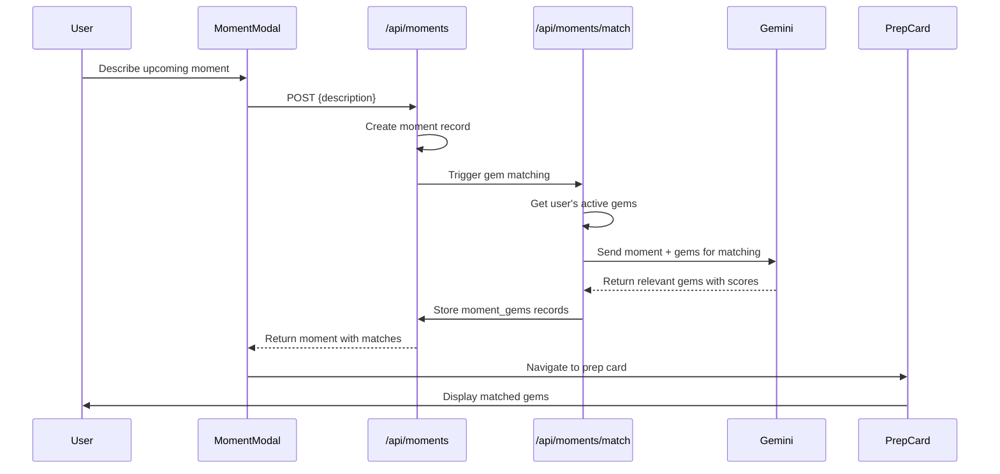
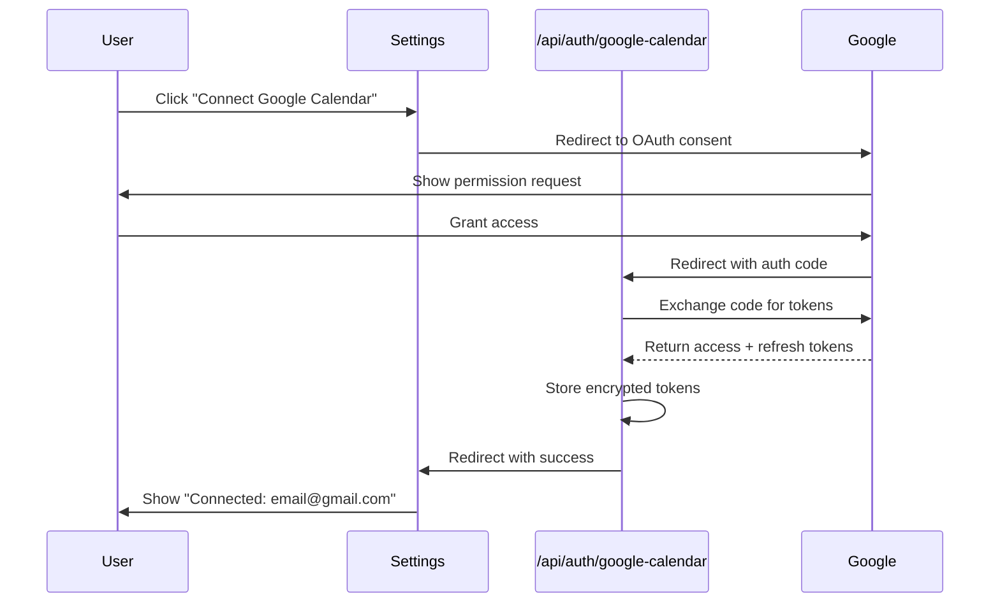
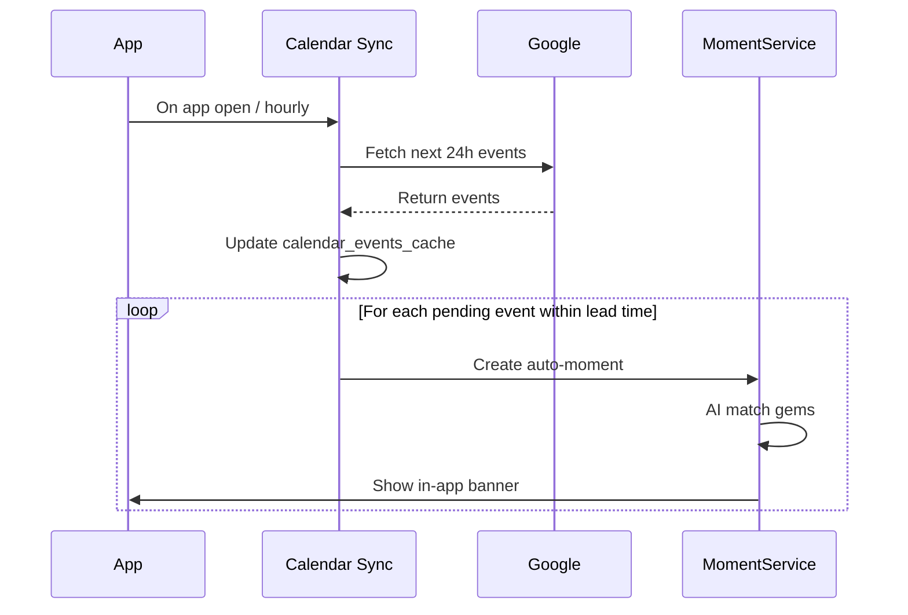

# GemKeeper Architecture

## 1. Overview

**GemKeeper** is a wisdom accountability partner application that helps users capture, remember, and apply insights from books, podcasts, videos, and life experiences. The app enforces intentionality by limiting users to 10 active "gems" at a time.

### Key Features
- **Gem Collection**: Capture insights manually or via AI extraction
- **Individual Gem Schedules**: Custom check-in times per gem (cron-like flexibility)
- **Moments**: On-demand situational gem surfacing with AI matching
- **Calendar Integration**: Auto-create moments from upcoming calendar events
- **Daily Prompts**: Morning reminder of a gem to apply
- **Evening Check-ins**: Track whether gems were applied
- **Graduation System**: Gems with 5+ applications move to Trophy Case
- **AI Extraction**: Use Google Gemini to extract insights from content

### Tech Stack Summary

| Layer | Technology |
|-------|------------|
| Framework | Next.js 16.1.4 (App Router) |
| Language | TypeScript 5 |
| Styling | Tailwind CSS 4 |
| UI Components | shadcn/ui + Radix UI |
| Database | Supabase (PostgreSQL) |
| Authentication | Supabase Auth |
| AI/ML | Google Gemini API 2.0 Flash |
| Calendar | Google Calendar API |
| Hosting | Vercel |
| Icons | Lucide React |

---

## 2. Project Structure

```
gemkeeper/
├── app/                          # Next.js App Router pages
│   ├── api/                      # API routes
│   │   ├── ai/extract/           # AI extraction endpoint
│   │   ├── gems/bulk/            # Bulk gem creation endpoint
│   │   ├── schedules/            # Gem schedule endpoints
│   │   │   └── parse/            # NLP schedule parsing
│   │   ├── moments/              # Moment endpoints
│   │   │   └── match/            # AI gem matching
│   │   └── auth/                 # OAuth callbacks
│   │       └── google-calendar/  # Google Calendar OAuth
│   ├── auth/                     # Auth actions (signup, signin, signout)
│   ├── checkin/                  # Evening check-in page
│   ├── daily/                    # Daily prompt page (morning gem)
│   ├── dashboard/                # Main dashboard
│   ├── gems/                     # Gem management
│   │   └── [id]/                 # Gem detail page
│   ├── moments/                  # Moments feature
│   │   ├── page.tsx              # Moments history
│   │   └── [id]/
│   │       └── prepare/          # Moment prep card page
│   ├── login/                    # Authentication page
│   ├── onboarding/               # First-time user setup
│   ├── settings/                 # User preferences
│   ├── trophy-case/              # Graduated gems showcase
│   ├── folders/                  # Folder organization
│   ├── notes/                    # Note operations
│   ├── layout.tsx                # Root layout
│   └── page.tsx                  # Home page
├── components/                   # React components
│   ├── ui/                       # shadcn/ui components
│   ├── gems/                     # Gem-related components
│   │   ├── gem-detail.tsx        # Gem display with actions
│   │   ├── gem-form.tsx          # Manual gem creation
│   │   ├── gem-edit-form.tsx     # Edit gem content
│   │   └── gem-card.tsx          # Gem card in list
│   ├── schedules/                # Schedule components
│   │   └── SchedulePicker.tsx    # Visual + NLP schedule picker
│   ├── moments/                  # Moment components
│   │   ├── MomentEntryModal.tsx  # Quick moment entry
│   │   ├── MomentFAB.tsx         # Floating action button
│   │   ├── MomentBanner.tsx      # Calendar event notification
│   │   ├── PrepCard.tsx          # Moment prep card display
│   │   └── RecentMoments.tsx     # Recent moments section
│   ├── settings/                 # Settings components
│   │   └── CalendarSettings.tsx  # Calendar connection UI
│   ├── extract-gems-modal.tsx    # AI extraction UI
│   ├── extracted-gem-card.tsx    # Review extracted gems
│   ├── graduate-gem-dialog.tsx   # Graduation confirmation
│   ├── retire-gem-dialog.tsx     # Retirement options
│   ├── app-sidebar.tsx           # Navigation sidebar
│   ├── layout-shell.tsx          # Main layout wrapper
│   ├── ai-consent-modal.tsx      # Privacy consent
│   ├── onboarding.tsx            # Onboarding carousel
│   └── ...                       # Other components
├── lib/                          # Utilities and services
│   ├── ai/                       # AI/Gemini integration
│   │   ├── gemini.ts             # Gemini API logic
│   │   └── rate-limit.ts         # Rate limiting & caching
│   ├── supabase/                 # Database clients
│   │   ├── client.ts             # Browser client
│   │   └── server.ts             # Server client
│   ├── types/                    # Type definitions
│   │   └── gem.ts                # Gem-related types
│   ├── types.ts                  # General types
│   ├── gems.ts                   # Gem service functions
│   ├── schedules.ts              # Schedule service functions
│   ├── moments.ts                # Moment service functions
│   ├── calendar.ts               # Calendar service functions
│   ├── calendar-sync.ts          # Background calendar sync
│   ├── matching.ts               # AI gem matching service
│   └── utils.ts                  # Utility helpers
├── types/                        # Additional type definitions
│   ├── schedules.ts              # Schedule types
│   ├── moments.ts                # Moment types
│   ├── calendar.ts               # Calendar types
│   └── matching.ts               # Matching types
├── __tests__/                    # Test files
│   ├── schedules/                # Schedule tests
│   ├── moments/                  # Moment tests
│   ├── calendar/                 # Calendar tests
│   ├── matching/                 # Matching tests
│   └── integration/              # E2E tests
├── public/                       # Static assets
├── middleware.ts                 # Auth middleware
├── env.example                   # Environment template
├── next.config.ts                # Next.js configuration
├── tailwind.config.js            # Tailwind configuration
├── tsconfig.json                 # TypeScript configuration
├── TASKS.md                      # Claude Code task definitions
└── supabase-schema.sql           # Database schema
```

### Directory Purposes

| Directory | Purpose |
|-----------|---------|
| `app/` | Next.js App Router pages and API routes |
| `app/api/` | Server-side API endpoints |
| `app/moments/` | Moment feature pages |
| `components/` | Reusable React components |
| `components/ui/` | shadcn/ui base components |
| `components/schedules/` | Gem scheduling components |
| `components/moments/` | Moment feature components |
| `components/settings/` | Settings page components |
| `lib/` | Business logic, services, utilities |
| `lib/ai/` | Google Gemini integration |
| `lib/supabase/` | Database client configuration |
| `types/` | TypeScript type definitions |
| `__tests__/` | Jest test files |
| `public/` | Static files served at root |

---

## 3. Tech Stack Details

### Next.js 16.1.4

**What it is**: React framework for production applications with server-side rendering, static generation, and API routes.

**Why it's used**:
- App Router provides file-based routing with React Server Components
- Built-in API routes for backend functionality
- Excellent TypeScript support
- Optimized for Vercel deployment

**Configuration** (`next.config.ts`):
```typescript
import type { NextConfig } from "next";

const nextConfig: NextConfig = {
  /* Currently minimal config, ready for extensions */
};

export default nextConfig;
```

### TypeScript 5

**What it is**: Typed superset of JavaScript for safer, more maintainable code.

**Why it's used**:
- Compile-time type checking prevents runtime errors
- Better IDE support with autocompletion
- Self-documenting code through interfaces
- Strict mode enabled for maximum safety

**Configuration** (`tsconfig.json`):
```json
{
  "compilerOptions": {
    "target": "ES2017",
    "strict": true,
    "paths": {
      "@/*": ["./*"]
    }
  }
}
```

### Tailwind CSS 4

**What it is**: Utility-first CSS framework for rapid UI development.

**Why it's used**:
- Rapid prototyping with utility classes
- Consistent design system
- No CSS file management
- Built-in responsive design
- Dark mode support

**Configuration** (`tailwind.config.js`):
- Custom color palette
- Extended spacing and typography
- Dark mode via class strategy

### shadcn/ui

**What it is**: Collection of re-usable components built on Radix UI primitives.

**Why it's used**:
- Accessible components out of the box
- Full control over styling (components are copied, not installed)
- Consistent design language
- Works seamlessly with Tailwind

**Components used**:
- `button`, `card`, `dialog`, `dropdown-menu`
- `input`, `label`, `select`, `textarea`
- `badge`, `toast`, `sheet`, `tabs`

### Supabase

**What it is**: Open-source Firebase alternative with PostgreSQL, auth, and storage.

**Why it's used**:
- **Database**: PostgreSQL with Row Level Security (RLS)
- **Auth**: Email/password authentication with session management
- **Storage**: File uploads for note attachments
- **Real-time**: WebSocket subscriptions (available if needed)

**Configuration** (`lib/supabase/`):

Browser client (`client.ts`):
```typescript
import { createBrowserClient } from "@supabase/ssr";

export function createClient() {
  return createBrowserClient(
    process.env.NEXT_PUBLIC_SUPABASE_URL!,
    process.env.NEXT_PUBLIC_SUPABASE_ANON_KEY!
  );
}
```

Server client (`server.ts`):
```typescript
import { createServerClient } from "@supabase/ssr";
import { cookies } from "next/headers";

export async function createClient() {
  const cookieStore = await cookies();
  return createServerClient(
    process.env.NEXT_PUBLIC_SUPABASE_URL!,
    process.env.NEXT_PUBLIC_SUPABASE_ANON_KEY!,
    {
      cookies: {
        getAll: () => cookieStore.getAll(),
        setAll: (cookiesToSet) => { /* ... */ }
      }
    }
  );
}
```

### Google Gemini API

**What it is**: Google's multimodal AI model for text and media understanding.

**Why it's used**:
- Extract actionable insights from long-form content
- Process images, audio, and video
- Parse natural language schedule inputs
- Match gems to moments based on context
- Cost-effective with generous free tier
- Fast inference with Flash model

**Model**: `gemini-2.0-flash-001`

**Configuration**: API key stored in `GOOGLE_AI_API_KEY` environment variable.

### Google Calendar API

**What it is**: API for reading and managing Google Calendar events.

**Why it's used**:
- Auto-create moments from upcoming calendar events
- Surface relevant gems before meetings
- Read-only access for privacy

**OAuth Scopes**:
- `https://www.googleapis.com/auth/calendar.readonly`
- `https://www.googleapis.com/auth/calendar.events.readonly`

**Configuration**: OAuth credentials stored in environment variables.

### Vercel

**What it is**: Platform for deploying and hosting Next.js applications.

**Why it's used**:
- Zero-config deployment for Next.js
- Automatic HTTPS and CDN
- Preview deployments for PRs
- Edge functions support
- Built-in analytics

---

## 4. Database Schema

### Entity Relationship Diagram



### Tables

#### `profiles`
User preferences and settings.

| Column | Type | Constraints | Description |
|--------|------|-------------|-------------|
| `id` | UUID | PK, FK → auth.users | User ID |
| `email` | TEXT | NOT NULL | User email |
| `name` | TEXT | | Display name |
| `timezone` | TEXT | | e.g., "America/Toronto" |
| `daily_prompt_time` | TIME | | Morning prompt time |
| `checkin_time` | TIME | | Evening check-in time |
| `calendar_connected` | BOOLEAN | DEFAULT false | Calendar integration |
| `onboarding_completed` | BOOLEAN | DEFAULT false | Completed onboarding |
| `ai_consent_given` | BOOLEAN | DEFAULT false | AI feature consent |
| `ai_consent_date` | TIMESTAMPTZ | | When consent was given |
| `auto_moment_enabled` | BOOLEAN | DEFAULT true | Auto-create moments from calendar |
| `auto_moment_lead_time` | INTEGER | DEFAULT 30 | Minutes before event to create moment |
| `auto_moment_filter` | VARCHAR(50) | DEFAULT 'all' | Event filter: all/meetings/custom |
| `created_at` | TIMESTAMPTZ | DEFAULT now() | |
| `updated_at` | TIMESTAMPTZ | DEFAULT now() | |

**RLS**: Users can only view/edit their own profile.

---

#### `gems`
Core feature table for wisdom gems.

| Column | Type | Constraints | Description |
|--------|------|-------------|-------------|
| `id` | UUID | PK | Gem ID |
| `user_id` | UUID | FK → auth.users, NOT NULL | Owner |
| `content` | TEXT | NOT NULL, max 200 chars | Gem text |
| `source` | TEXT | | Book/podcast/article name |
| `source_url` | TEXT | | URL to source |
| `context_tag` | ENUM | | Category tag |
| `custom_context` | TEXT | | Custom tag (when other) |
| `status` | ENUM | DEFAULT 'active' | active/retired/graduated |
| `application_count` | INTEGER | DEFAULT 0 | Times applied |
| `skip_count` | INTEGER | DEFAULT 0 | Times skipped |
| `last_surfaced_at` | TIMESTAMPTZ | | Last shown to user |
| `last_applied_at` | TIMESTAMPTZ | | Last applied |
| `retired_at` | TIMESTAMPTZ | | When archived/released |
| `graduated_at` | TIMESTAMPTZ | | When graduated |
| `created_at` | TIMESTAMPTZ | DEFAULT now() | |
| `updated_at` | TIMESTAMPTZ | DEFAULT now() | |

**Context Tags**: `meetings`, `feedback`, `conflict`, `focus`, `health`, `relationships`, `parenting`, `other`

**Status Values**: `active`, `retired`, `graduated`

**Indexes**: `user_id`, `status`, `created_at`

**RLS**: Users can only CRUD their own gems.

---

#### `gem_schedules`
Individual check-in schedules per gem.

| Column | Type | Constraints | Description |
|--------|------|-------------|-------------|
| `id` | UUID | PK | Schedule ID |
| `gem_id` | UUID | FK → gems, NOT NULL | Associated gem |
| `user_id` | UUID | FK → auth.users, NOT NULL | Owner |
| `cron_expression` | VARCHAR(100) | NOT NULL | Cron format: "0 14 * * 2" |
| `human_readable` | VARCHAR(255) | NOT NULL | "Every Tuesday at 2:00 PM" |
| `timezone` | VARCHAR(50) | DEFAULT 'America/Toronto' | Schedule timezone |
| `schedule_type` | VARCHAR(20) | DEFAULT 'custom' | daily/weekly/monthly/custom |
| `days_of_week` | INTEGER[] | | [1,2,3,4,5] for weekdays |
| `time_of_day` | TIME | | 14:00:00 |
| `day_of_month` | INTEGER | | 1-31, or -1 for last day |
| `is_active` | BOOLEAN | DEFAULT true | Toggle on/off |
| `next_trigger_at` | TIMESTAMPTZ | | Pre-computed next trigger |
| `last_triggered_at` | TIMESTAMPTZ | | Last trigger time |
| `created_at` | TIMESTAMPTZ | DEFAULT now() | |
| `updated_at` | TIMESTAMPTZ | DEFAULT now() | |

**Indexes**: `gem_id`, `user_id`, `is_active`, `next_trigger_at`

**RLS**: Users can only manage their own schedules.

---

#### `moments`
User-created or calendar-triggered moments for gem surfacing.

| Column | Type | Constraints | Description |
|--------|------|-------------|-------------|
| `id` | UUID | PK | Moment ID |
| `user_id` | UUID | FK → auth.users, NOT NULL | Owner |
| `description` | TEXT | NOT NULL | User's moment description |
| `source` | VARCHAR(20) | DEFAULT 'manual' | manual/calendar |
| `calendar_event_id` | VARCHAR(255) | | External calendar event ID |
| `calendar_event_title` | VARCHAR(500) | | Event title for display |
| `calendar_event_start` | TIMESTAMPTZ | | Event start time |
| `gems_matched_count` | INTEGER | DEFAULT 0 | Number of gems matched |
| `ai_processing_time_ms` | INTEGER | | AI matching duration |
| `status` | VARCHAR(20) | DEFAULT 'active' | active/completed/dismissed |
| `completed_at` | TIMESTAMPTZ | | When marked complete |
| `created_at` | TIMESTAMPTZ | DEFAULT now() | |
| `updated_at` | TIMESTAMPTZ | DEFAULT now() | |

**Indexes**: `user_id`, `created_at`, `calendar_event_id`, `status`

**RLS**: Users can only access their own moments.

---

#### `moment_gems`
Junction table linking moments to matched gems with AI relevance data.

| Column | Type | Constraints | Description |
|--------|------|-------------|-------------|
| `id` | UUID | PK | Record ID |
| `moment_id` | UUID | FK → moments, NOT NULL | Parent moment |
| `gem_id` | UUID | FK → gems, NOT NULL | Matched gem |
| `user_id` | UUID | FK → auth.users, NOT NULL | Owner |
| `relevance_score` | FLOAT | NOT NULL, 0.0-1.0 | AI relevance score |
| `relevance_reason` | TEXT | | AI explanation |
| `was_helpful` | BOOLEAN | | User feedback |
| `was_reviewed` | BOOLEAN | DEFAULT false | User marked "got it" |
| `created_at` | TIMESTAMPTZ | DEFAULT now() | |

**Unique Constraint**: `(moment_id, gem_id)`

**Indexes**: `moment_id`, `gem_id`, `user_id`, `relevance_score`

**RLS**: Users can only access their own moment_gems.

---

#### `calendar_connections`
OAuth tokens for connected calendars.

| Column | Type | Constraints | Description |
|--------|------|-------------|-------------|
| `id` | UUID | PK | Connection ID |
| `user_id` | UUID | FK → auth.users, NOT NULL | Owner |
| `provider` | VARCHAR(20) | NOT NULL | 'google' (outlook future) |
| `email` | VARCHAR(255) | NOT NULL | Calendar account email |
| `access_token` | TEXT | NOT NULL | OAuth access token |
| `refresh_token` | TEXT | NOT NULL | OAuth refresh token |
| `token_expires_at` | TIMESTAMPTZ | | Token expiration |
| `is_active` | BOOLEAN | DEFAULT true | Connection active |
| `last_sync_at` | TIMESTAMPTZ | | Last successful sync |
| `sync_error` | TEXT | | Last sync error message |
| `created_at` | TIMESTAMPTZ | DEFAULT now() | |
| `updated_at` | TIMESTAMPTZ | DEFAULT now() | |

**Unique Constraint**: `(user_id, provider, email)`

**Indexes**: `user_id`, `is_active`

**RLS**: Users can only access their own calendar connections.

---

#### `calendar_events_cache`
Cached upcoming calendar events for moment generation.

| Column | Type | Constraints | Description |
|--------|------|-------------|-------------|
| `id` | UUID | PK | Cache entry ID |
| `user_id` | UUID | FK → auth.users, NOT NULL | Owner |
| `connection_id` | UUID | FK → calendar_connections, NOT NULL | Source connection |
| `external_event_id` | VARCHAR(255) | NOT NULL | Calendar provider's event ID |
| `title` | VARCHAR(500) | NOT NULL | Event title |
| `description` | TEXT | | Event description |
| `start_time` | TIMESTAMPTZ | NOT NULL | Event start |
| `end_time` | TIMESTAMPTZ | NOT NULL | Event end |
| `moment_created` | BOOLEAN | DEFAULT false | Moment already generated |
| `moment_id` | UUID | FK → moments | Generated moment |
| `created_at` | TIMESTAMPTZ | DEFAULT now() | |
| `updated_at` | TIMESTAMPTZ | DEFAULT now() | |

**Unique Constraint**: `(connection_id, external_event_id)`

**Indexes**: `user_id`, `start_time`, `moment_created`

**RLS**: Users can only access their own cached events.

---

#### `gem_checkins`
Check-in history for tracking gem applications.

| Column | Type | Constraints | Description |
|--------|------|-------------|-------------|
| `id` | UUID | PK | Check-in ID |
| `gem_id` | UUID | FK → gems | Associated gem |
| `user_id` | UUID | FK → auth.users | User |
| `checkin_type` | ENUM | | morning_prompt/evening_checkin |
| `response` | ENUM | | yes/no/maybe |
| `note` | TEXT | | Reflection notes |
| `created_at` | TIMESTAMPTZ | DEFAULT now() | |

**Indexes**: `gem_id`, `user_id`, `created_at`

---

#### `notes`
User notes and staging area for content.

| Column | Type | Constraints | Description |
|--------|------|-------------|-------------|
| `id` | UUID | PK | Note ID |
| `user_id` | UUID | FK → auth.users | Owner |
| `title` | TEXT | | Note title |
| `content` | TEXT | | Note content |
| `folder_id` | UUID | FK → folders, ON DELETE SET NULL | Organization |
| `tags` | TEXT[] | | Tags array |
| `is_favorite` | BOOLEAN | DEFAULT false | Favorited |
| `created_at` | TIMESTAMPTZ | DEFAULT now() | |
| `updated_at` | TIMESTAMPTZ | DEFAULT now() | |

**Indexes**: `user_id`, `updated_at`, `is_favorite`

**RLS**: Users can only access their own notes.

---

#### `note_attachments`
Media files attached to notes.

| Column | Type | Constraints | Description |
|--------|------|-------------|-------------|
| `id` | UUID | PK | Attachment ID |
| `note_id` | UUID | FK → notes | Parent note |
| `file_name` | TEXT | | Original filename |
| `file_type` | TEXT | | MIME type |
| `file_size` | INTEGER | | Size in bytes |
| `storage_path` | TEXT | | Supabase Storage path |
| `created_at` | TIMESTAMPTZ | DEFAULT now() | |

**RLS**: Users can only access attachments on their notes.

---

#### `folders`
Note organization structure.

| Column | Type | Constraints | Description |
|--------|------|-------------|-------------|
| `id` | UUID | PK | Folder ID |
| `user_id` | UUID | FK → auth.users | Owner |
| `name` | TEXT | | Folder name |
| `created_at` | TIMESTAMPTZ | DEFAULT now() | |
| `updated_at` | TIMESTAMPTZ | DEFAULT now() | |

**RLS**: Users can only manage their own folders.

---

#### `ai_usage`
Daily rate limiting for AI features.

| Column | Type | Constraints | Description |
|--------|------|-------------|-------------|
| `id` | UUID | PK | Usage ID |
| `user_id` | UUID | FK → auth.users | User |
| `usage_date` | DATE | | Date of usage |
| `extraction_count` | INTEGER | DEFAULT 0 | Extractions today (max 10) |
| `tokens_used` | INTEGER | DEFAULT 0 | Tokens today (max 50,000) |
| `created_at` | TIMESTAMPTZ | DEFAULT now() | |
| `updated_at` | TIMESTAMPTZ | DEFAULT now() | |

**Unique Constraint**: `(user_id, usage_date)`

---

#### `ai_extractions`
Cached extraction results.

| Column | Type | Constraints | Description |
|--------|------|-------------|-------------|
| `id` | UUID | PK | Extraction ID |
| `user_id` | UUID | FK → auth.users | User |
| `input_content` | TEXT | | First 10,000 chars |
| `input_hash` | VARCHAR(64) | | SHA-256 hash for dedup |
| `source` | TEXT | | User attribution |
| `extracted_gems` | JSONB | | Array of extracted gems |
| `tokens_used` | INTEGER | | Tokens consumed |
| `created_at` | TIMESTAMPTZ | DEFAULT now() | |

**Indexes**: `user_id`, `input_hash`

---

## 5. API Routes

### Gem Extraction

#### POST `/api/ai/extract`

Extract gems from content using Gemini AI.

**Request Body**:
```typescript
{
  content?: string;           // Text (100-10,000 chars)
  source?: string;            // Attribution
  media?: Array<{
    mimeType: string;         // e.g., "image/png"
    data: string;             // Base64 encoded
  }>;
}
```

**Response**:
```typescript
{
  gems: ExtractedGem[];
  cached: boolean;
  usage: {
    extractionsToday: number;
    extractionsRemaining: number;
    tokensToday: number;
    canExtract: boolean;
    resetTime: Date;
  };
}
```

---

### Bulk Gem Creation

#### POST `/api/gems/bulk`

Create multiple gems at once (from AI extraction).

**Request Body**:
```typescript
{
  gems: Array<{
    content: string;
    context_tag: ContextTag;
    source?: string;
    source_url?: string;
  }>;
}
```

**Response**:
```typescript
{
  gems: Gem[];
  count: number;
}
```

---

### Schedule Parsing

#### POST `/api/schedules/parse`

Parse natural language into schedule object using AI.

**Request Body**:
```typescript
{
  text: string;  // "every Tuesday at 2pm"
}
```

**Response**:
```typescript
{
  result: {
    cron_expression: string;      // "0 14 * * 2"
    human_readable: string;       // "Every Tuesday at 2:00 PM"
    schedule_type: string;        // "weekly"
    days_of_week: number[] | null;
    time_of_day: string;          // "14:00"
    day_of_month: number | null;
    confidence: number;           // 0.0-1.0
  }
}
```

---

### Moment Creation

#### POST `/api/moments`

Create a moment and trigger AI gem matching.

**Request Body**:
```typescript
{
  description: string;
  source?: 'manual' | 'calendar';
  calendarData?: {
    event_id: string;
    event_title: string;
    event_start: string;
  };
}
```

**Response**:
```typescript
{
  moment: {
    id: string;
    description: string;
    source: string;
    gems_matched_count: number;
    matched_gems: MomentGem[];
    created_at: string;
  }
}
```

---

### Gem Matching

#### POST `/api/moments/match`

Match gems to an existing moment using AI.

**Request Body**:
```typescript
{
  moment_id: string;
}
```

**Response**:
```typescript
{
  matches: Array<{
    gem_id: string;
    relevance_score: number;
    relevance_reason: string;
  }>;
  processing_time_ms: number;
}
```

---

### Calendar OAuth

#### GET `/api/auth/google-calendar`

OAuth callback for Google Calendar connection.

**Query Parameters**:
- `code`: Authorization code from Google
- `state`: CSRF token

**Response**: Redirects to settings page with success/error message.

---

## 6. Key Components

### Layout Components

| Component | File | Purpose |
|-----------|------|---------|
| Root Layout | `app/layout.tsx` | HTML structure, providers |
| Layout Shell | `components/layout-shell.tsx` | Header, sidebar, content area |
| App Sidebar | `components/app-sidebar.tsx` | Navigation menu |

### Page Components

| Page | File | Purpose |
|------|------|---------|
| Home | `app/page.tsx` | Landing/redirect based on auth |
| Login | `app/login/page.tsx` | Authentication |
| Gems | `app/gems/page.tsx` | Active gems list |
| Gem Detail | `app/gems/[id]/page.tsx` | Single gem view with schedules |
| Daily | `app/daily/page.tsx` | Morning prompt |
| Check-in | `app/checkin/page.tsx` | Evening check-in |
| Trophy Case | `app/trophy-case/page.tsx` | Graduated gems |
| Moments | `app/moments/page.tsx` | Moments history |
| Prep Card | `app/moments/[id]/prepare/page.tsx` | Moment prep card |
| Settings | `app/settings/page.tsx` | User preferences + calendar |
| Onboarding | `app/onboarding/page.tsx` | First-time setup |

### Gem Components

| Component | File | Purpose |
|-----------|------|---------|
| Gem Detail | `components/gems/gem-detail.tsx` | Display gem with actions + schedules |
| Gem Form | `components/gems/gem-form.tsx` | Manual creation |
| Gem Edit Form | `components/gems/gem-edit-form.tsx` | Modify existing gem |
| Gem Card | `components/gems/gem-card.tsx` | List item with schedule badge |
| Extracted Gem Card | `components/extracted-gem-card.tsx` | Review AI extractions |
| Graduate Dialog | `components/graduate-gem-dialog.tsx` | Graduation confirmation |
| Retire Dialog | `components/retire-gem-dialog.tsx` | Archive/release options |

### Schedule Components

| Component | File | Purpose |
|-----------|------|---------|
| Schedule Picker | `components/schedules/SchedulePicker.tsx` | Visual + NLP schedule editor |

### Moment Components

| Component | File | Purpose |
|-----------|------|---------|
| Moment Entry Modal | `components/moments/MomentEntryModal.tsx` | Quick moment creation |
| Moment FAB | `components/moments/MomentFAB.tsx` | Floating action button trigger |
| Moment Banner | `components/moments/MomentBanner.tsx` | Calendar event notification |
| Prep Card | `components/moments/PrepCard.tsx` | Display matched gems |
| Recent Moments | `components/moments/RecentMoments.tsx` | History section |

### Settings Components

| Component | File | Purpose |
|-----------|------|---------|
| Calendar Settings | `components/settings/CalendarSettings.tsx` | Google Calendar connection |

### Modal Components

| Component | File | Purpose |
|-----------|------|---------|
| Extract Gems Modal | `components/extract-gems-modal.tsx` | AI extraction wizard |
| AI Consent Modal | `components/ai-consent-modal.tsx` | Privacy consent |

### UI Components (shadcn/ui)

Located in `components/ui/`:
- `badge.tsx` - Status indicators
- `button.tsx` - Action buttons
- `card.tsx` - Content containers
- `dialog.tsx` - Modal dialogs
- `dropdown-menu.tsx` - Context menus
- `input.tsx` - Text inputs
- `label.tsx` - Form labels
- `select.tsx` - Dropdown selects
- `sheet.tsx` - Slide-out panels
- `tabs.tsx` - Tab navigation
- `textarea.tsx` - Multi-line inputs

---

## 7. Services & Libraries

### Supabase Clients (`lib/supabase/`)

**`client.ts`** - Browser client for client components:
```typescript
import { createBrowserClient } from "@supabase/ssr";

export function createClient() {
  return createBrowserClient(
    process.env.NEXT_PUBLIC_SUPABASE_URL!,
    process.env.NEXT_PUBLIC_SUPABASE_ANON_KEY!
  );
}
```

**`server.ts`** - Server client for server components and actions:
```typescript
export async function createClient() {
  const cookieStore = await cookies();
  return createServerClient(/* ... */);
}
```

### Gem Service (`lib/gems.ts`)

**CRUD Operations**:
- `createMultipleGems(gems[])` - Bulk insert
- `updateGem(id, input)` - Modify gem
- `deleteGem(gemId)` - Permanent deletion
- `retireGem(id, mode)` - Archive or release
- `graduateGem(id)` - Move to trophy case

**Queries**:
- `getActiveGems()` - All active gems
- `getActiveGemCount()` - Count of active gems
- `getDailyGem()` - Least recently surfaced gem
- `getGraduatedGems()` - Trophy case gems

**Check-in**:
- `logCheckin(gemId, type, response, note?)` - Record check-in

### Schedule Service (`lib/schedules.ts`)

**CRUD Operations**:
- `createGemSchedule(gemId, input)` - Create schedule
- `getGemSchedules(gemId)` - Get schedules for gem
- `updateGemSchedule(scheduleId, updates)` - Modify schedule
- `deleteGemSchedule(scheduleId)` - Remove schedule
- `toggleScheduleActive(scheduleId, isActive)` - Enable/disable

**Utilities**:
- `generateCronExpression(input)` - Convert input to cron
- `generateHumanReadable(input)` - Convert to readable string
- `calculateNextTrigger(cron, timezone)` - Compute next trigger time

### Moment Service (`lib/moments.ts`)

**CRUD Operations**:
- `createMoment(description, source?, calendarData?)` - Create moment
- `getMoment(momentId)` - Get moment with matched gems
- `getRecentMoments(limit?)` - Get recent moments
- `updateMomentStatus(momentId, status)` - Mark complete/dismissed

**Feedback**:
- `recordMomentGemFeedback(momentGemId, wasHelpful)` - Record feedback
- `markGemReviewed(momentGemId)` - Mark as "got it"

### Calendar Service (`lib/calendar.ts`)

**Connection Management**:
- `connectGoogleCalendar(code)` - Exchange OAuth code for tokens
- `disconnectCalendar(connectionId)` - Remove connection
- `getCalendarConnections()` - List connections

**Sync Operations**:
- `syncCalendarEvents(connectionId)` - Fetch events from Google
- `getPendingEventsForMoments()` - Get events needing moments

**Token Management**:
- `refreshGoogleToken(connectionId)` - Refresh expired tokens

### Matching Service (`lib/matching.ts`)

**AI Matching**:
- `matchGemsToMoment(description, gems)` - AI-powered gem matching

### AI Integration (`lib/ai/gemini.ts`)

**Functions**:
```typescript
// Extract from text content
extractGemsFromContent(content: string, source?: string): Promise<ExtractionResult>

// Extract from multimedia
extractGemsFromMultimedia(
  textContent: string | null,
  mediaData: MediaInput[],
  source?: string
): Promise<ExtractionResult>

// Parse schedule from natural language
parseScheduleNLP(text: string): Promise<NLPScheduleResult>

// Match gems to moment
matchGemsToMoment(momentDescription: string, gems: Gem[]): Promise<MatchingResponse>
```

### Rate Limiting (`lib/ai/rate-limit.ts`)

**Limits**:
- 10 extractions per day
- 50,000 tokens per day
- 20 moment matches per hour
- Resets at midnight UTC

**Functions**:
```typescript
checkUsageLimit(userId: string): Promise<UsageStatus>
recordUsage(userId: string, tokensUsed: number): Promise<void>
getCachedExtraction(userId: string, hash: string): Promise<CachedResult | null>
cacheExtraction(userId: string, hash: string, ...): Promise<void>
hashContent(content: string): string  // SHA-256
```

---

## 8. Authentication Flow

### Middleware (`middleware.ts`)

```typescript
export async function middleware(request: NextRequest) {
  const { pathname } = request.nextUrl;

  // Refresh session
  const supabase = createClient(/* ... */);
  const { data: { user } } = await supabase.auth.getUser();

  // Protected routes
  const protectedRoutes = ['/dashboard', '/gems', '/daily', '/checkin', '/moments', ...];

  if (protectedRoutes.includes(pathname)) {
    if (!user) {
      return NextResponse.redirect('/login');
    }

    // Check onboarding
    if (!profile.onboarding_completed && pathname !== '/onboarding') {
      return NextResponse.redirect('/onboarding');
    }
  }

  // Redirect logged-in users from login
  if (pathname === '/login' && user) {
    return NextResponse.redirect('/gems');
  }
}
```

### Auth Actions (`app/auth/actions.ts`)

```typescript
"use server"

export async function signUp(formData: FormData) {
  const supabase = await createClient();
  const { error } = await supabase.auth.signUp({
    email,
    password,
  });
  // Creates profile automatically via trigger
}

export async function signIn(formData: FormData) {
  const supabase = await createClient();
  const { error } = await supabase.auth.signInWithPassword({
    email,
    password,
  });
}

export async function signOut() {
  const supabase = await createClient();
  await supabase.auth.signOut();
}
```

### Session Management

- Sessions stored in HTTP-only cookies
- Automatic refresh on each request via middleware
- Supabase handles JWT tokens and expiration

---

## 9. AI Integration

### Gemini API Setup

**Model**: `gemini-2.0-flash-001`

**Initialization**:
```typescript
import { GoogleGenerativeAI } from "@google/generative-ai";

const genAI = new GoogleGenerativeAI(process.env.GOOGLE_AI_API_KEY!);
const model = genAI.getGenerativeModel({ model: "gemini-2.0-flash-001" });
```

### Extraction Flow



### Moment Matching Flow



### Rate Limiting Strategy

| Limit | Value | Purpose |
|-------|-------|---------|
| Extractions/day | 10 | Prevent abuse |
| Tokens/day | 50,000 | Control costs |
| Moment matches/hour | 20 | Prevent spam |
| Reset time | Midnight UTC | Daily refresh |

### Caching Strategy

- **Key**: SHA-256 hash of input content
- **Scope**: Text-only extractions (not multimedia)
- **Storage**: `ai_extractions` table
- **Benefit**: Avoids re-processing identical content

---

## 10. Calendar Integration

### Google Calendar OAuth Flow



### Calendar Sync Flow



### OAuth Configuration

**Google Cloud Console Setup**:
1. Create OAuth 2.0 Client ID
2. Enable Google Calendar API
3. Set redirect URI: `https://gemkeeper.vercel.app/api/auth/google-calendar`

**Scopes**:
- `https://www.googleapis.com/auth/calendar.readonly`
- `https://www.googleapis.com/auth/calendar.events.readonly`

**Environment Variables**:
```bash
GOOGLE_CALENDAR_CLIENT_ID=your_client_id
GOOGLE_CALENDAR_CLIENT_SECRET=your_client_secret
GOOGLE_CALENDAR_REDIRECT_URI=https://gemkeeper.vercel.app/api/auth/google-calendar
```

---

## 11. Deployment

### Vercel Configuration

GemKeeper is deployed on Vercel with automatic deployments from the main branch.

**Build Settings**:
- Framework: Next.js
- Build Command: `next build`
- Output Directory: `.next`
- Install Command: `npm install`

### Environment Variables

Required in Vercel dashboard:

```bash
# Supabase
NEXT_PUBLIC_SUPABASE_URL=https://[project-id].supabase.co
NEXT_PUBLIC_SUPABASE_ANON_KEY=[anon-key]

# Google Gemini
GOOGLE_AI_API_KEY=[api-key]

# Google Calendar OAuth
GOOGLE_CALENDAR_CLIENT_ID=[client-id]
GOOGLE_CALENDAR_CLIENT_SECRET=[client-secret]
GOOGLE_CALENDAR_REDIRECT_URI=https://gemkeeper.vercel.app/api/auth/google-calendar
```

### Build Process

1. Push to main branch triggers deployment
2. Vercel runs `npm install`
3. Vercel runs `next build`
4. Static pages are pre-rendered
5. API routes deployed as serverless functions
6. CDN caches static assets

### Preview Deployments

- Every PR gets a preview URL
- Isolated from production
- Uses same environment variables

---

## 12. External Services

### Supabase

**Project URL**: `https://[project-id].supabase.co`

**Features Used**:
- PostgreSQL database
- Row Level Security (RLS)
- Authentication (email/password)
- Storage (for attachments)

**Dashboard**: Manage schema, users, and policies at `supabase.com/dashboard`

### Google AI Studio

**Console**: `aistudio.google.com`

**API Key**: Generate at AI Studio for Gemini API access

**Model Used**: `gemini-2.0-flash-001` (fast, multimodal)

**Pricing**: Free tier available, then pay-per-token

### Google Cloud Console

**Console**: `console.cloud.google.com`

**APIs Used**:
- Google Calendar API

**OAuth**: Manage credentials and consent screen

### Vercel

**Dashboard**: `vercel.com/dashboard`

**Features**:
- Automatic deployments
- Preview URLs
- Analytics
- Logs

---

## Appendix A: Type Definitions

### Gem Types (`lib/types/gem.ts`)

```typescript
type ContextTag =
  | "meetings"
  | "feedback"
  | "conflict"
  | "focus"
  | "health"
  | "relationships"
  | "parenting"
  | "other";

type GemStatus = "active" | "retired" | "graduated";

interface Gem {
  id: string;
  user_id: string;
  content: string;
  source: string | null;
  source_url: string | null;
  context_tag: ContextTag;
  custom_context: string | null;
  status: GemStatus;
  application_count: number;
  skip_count: number;
  last_surfaced_at: string | null;
  last_applied_at: string | null;
  retired_at: string | null;
  graduated_at: string | null;
  created_at: string;
  updated_at: string;
}

interface CreateGemInput {
  content: string;
  source?: string;
  source_url?: string;
  context_tag: ContextTag;
  custom_context?: string;
}

const MAX_ACTIVE_GEMS = 10;
```

### Schedule Types (`types/schedules.ts`)

```typescript
interface GemSchedule {
  id: string;
  gem_id: string;
  user_id: string;
  cron_expression: string;
  human_readable: string;
  timezone: string;
  schedule_type: 'daily' | 'weekly' | 'monthly' | 'custom';
  days_of_week: number[] | null;
  time_of_day: string | null;
  day_of_month: number | null;
  is_active: boolean;
  next_trigger_at: string | null;
  last_triggered_at: string | null;
  created_at: string;
  updated_at: string;
}

interface ScheduleInput {
  schedule_type: 'daily' | 'weekly' | 'monthly' | 'custom';
  days_of_week?: number[];
  time_of_day: string;
  day_of_month?: number;
  timezone?: string;
}

interface NLPScheduleResult {
  cron_expression: string;
  human_readable: string;
  schedule_type: 'daily' | 'weekly' | 'monthly' | 'custom';
  days_of_week: number[] | null;
  time_of_day: string;
  day_of_month: number | null;
  confidence: number;
}
```

### Moment Types (`types/moments.ts`)

```typescript
interface Moment {
  id: string;
  user_id: string;
  description: string;
  source: 'manual' | 'calendar';
  calendar_event_id: string | null;
  calendar_event_title: string | null;
  calendar_event_start: string | null;
  gems_matched_count: number;
  ai_processing_time_ms: number | null;
  status: 'active' | 'completed' | 'dismissed';
  completed_at: string | null;
  created_at: string;
  updated_at: string;
}

interface MomentGem {
  id: string;
  moment_id: string;
  gem_id: string;
  user_id: string;
  relevance_score: number;
  relevance_reason: string | null;
  was_helpful: boolean | null;
  was_reviewed: boolean;
  created_at: string;
  gem?: Gem;
}

interface MomentWithGems extends Moment {
  matched_gems: MomentGem[];
}
```

### Calendar Types (`types/calendar.ts`)

```typescript
interface CalendarConnection {
  id: string;
  user_id: string;
  provider: 'google';
  email: string;
  is_active: boolean;
  last_sync_at: string | null;
  sync_error: string | null;
  created_at: string;
  updated_at: string;
}

interface CalendarEvent {
  id: string;
  external_event_id: string;
  title: string;
  description: string | null;
  start_time: string;
  end_time: string;
  moment_created: boolean;
  moment_id: string | null;
}

interface CalendarSyncResult {
  events_synced: number;
  events_added: number;
  events_updated: number;
  errors: string[];
}
```

### Matching Types (`types/matching.ts`)

```typescript
interface GemMatch {
  gem_id: string;
  relevance_score: number;
  relevance_reason: string;
}

interface MatchingRequest {
  moment_description: string;
  gems: Array<{
    id: string;
    content: string;
    context_tag: string;
    source: string | null;
  }>;
}

interface MatchingResponse {
  matches: GemMatch[];
  processing_time_ms: number;
}
```

### Profile & Note Types (`lib/types.ts`)

```typescript
interface Profile {
  id: string;
  email: string;
  name: string | null;
  daily_prompt_time: string | null;
  checkin_time: string | null;
  timezone: string | null;
  calendar_connected: boolean;
  onboarding_completed: boolean;
  ai_consent_given: boolean;
  ai_consent_date: string | null;
  auto_moment_enabled: boolean;
  auto_moment_lead_time: number;
  auto_moment_filter: string;
  created_at: string;
  updated_at: string;
}

interface Note {
  id: string;
  title: string | null;
  content: string | null;
  folder_id: string | null;
  attachments?: NoteAttachment[];
  created_at: string;
  updated_at: string;
  user_id: string;
  tags?: string[];
  is_favorite?: boolean;
}

interface NoteAttachment {
  id: string;
  note_id: string;
  file_name: string;
  file_type: string;
  file_size: number;
  storage_path: string;
  created_at: string;
}
```

---

## Appendix B: Dependencies

### Production Dependencies

```json
{
  "dependencies": {
    "@google/generative-ai": "^0.x",
    "@radix-ui/react-*": "various",
    "@supabase/ssr": "^0.x",
    "@supabase/supabase-js": "^2.x",
    "class-variance-authority": "^0.x",
    "clsx": "^2.x",
    "cron-parser": "^4.x",
    "googleapis": "^130.x",
    "lucide-react": "^0.x",
    "next": "^16.x",
    "react": "^19.x",
    "react-dom": "^19.x",
    "tailwind-merge": "^2.x",
    "tailwindcss-animate": "^1.x"
  }
}
```

### Dev Dependencies

```json
{
  "devDependencies": {
    "@testing-library/jest-dom": "^6.x",
    "@testing-library/react": "^16.x",
    "@types/node": "^22.x",
    "@types/react": "^19.x",
    "eslint": "^9.x",
    "eslint-config-next": "^16.x",
    "jest": "^29.x",
    "postcss": "^8.x",
    "tailwindcss": "^4.x",
    "typescript": "^5.x"
  }
}
```
